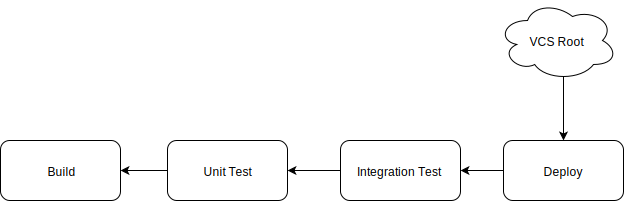

## TeamCity: Leverage Snapshot Dependencies 

We used to rely solely on artifact dependencies and finish build triggers in TeamCity to coordinate build chains.  This was simple and worked well, but as our builds grew in complexity, this approach began to break down.  We started experiencing slow, brittle, and less reliable builds.  It was also difficult to ensure that the same set of artifacts was being used across all of our builds without generating and consuming artifacts at each step.  Fortunately, TeamCity has a feature called Snapshot Dependencies that provides greater flexibility in triggering and coordinating work between builds.

### What are Snapshot Dependencies?

The first step of most builds is fetching content from a source control repository and populating a directory on the TeamCity agent.  If you need to run two builds processes in a chain, and ensure that they originate from the exact same source, how would you do this?  Snapshot dependencies are the answer!  When two builds share the same VCS root (or set of VCS roots) then a snapshot dependency ensures that the two builds share the **exact** same content.  The directories on the agents are guaranteed to be populated with the exact same VCS snapshot.  In the case of Git, this means that the two builds point at the exact same commit.  In Team City nomenclature this is providing *Source Code Consistency* between builds.

> Source Code Consistency - You can be assured that all builds in a Snapshot dependency chain are operating on the same version of the source code.

Snapshot dependencies also provide a mechanism for triggering dependent builds.  They ensure that any other builds higher in the chain (direct or indirect dependencies of the build) are run (on the same source snapshot) before the triggered build is allowed to run.  The build chain becomes a hierarchy of dependencies which ensures that all dependencies are satisfied in the chain before a build can begin.

### Artifact Dependencies and VCS Triggers

When using artifact dependencies alone, subsequent builds in a chain are usually triggered by Finish Build Triggers.  Basically you tell the build to run when the build before it completes.  You trigger on the completion of another build.  Do this, then do this, then do this..  There is usually a VCS Root trigger on the initial build which initiates the build of all steps in the chain.

Let's take a look at an example.  This is a trivial scenario where we want to build, unit test, integration test, and then deploy an application.  We want to make sure that our application builds and all the tests pass before deploying.

#### Finish Build Triggers Passing Artifact Dependencies between Builds

This diagram shows how this might work using artifact dependencies and VCS Finish Build triggers.  The arrows show the direction of the triggers, as each build completes it then triggers the next build in the chain.  A change in the VCS root triggers the initial build step, which triggers the unit test step, which triggers the integration test step, and then finally the deployment step.  As each step in this chain finishes, it triggers the next step and passes the artifacts to it.  If we want to ensure that Build, Unit Test, and Integration Test builds complete before we deploy our application, then they will need to be done serially as depicted by the diagram.

 

Since there is no way, with this setup, to ensure all of the builds in the chain use the the same source code, it is necessary to pass the the generated artifacts to each step in the chain.  In this way we can be sure that the entire build chain is operating on the same set of artifacts as the initial build.  This means that before any of the other steps can be run, the build must be completed and it must pass any source files necessary to all other builds in the chain using artifacts. 

 

The generated artifacts bind the builds together in this case.  These artifacts must be created as a zip file by the Build process and then unzipped by each of the dependent builds.  Another alternative to passing artifacts in this way is to ensure all builds run on the same build agent and in the same folder.  However, this is obviously not a very flexible approach,

 

### Snapshot Dependencies: Triggers are Inverted

When using snapshot dependencies, builds in a chain do not have to be started by triggering the first step of the chain.  Instead you can just trigger the final build you want to run.  The snapshot dependencies will ensure that all steps upon which the triggered build depends upon will be satisfied.  The snapshot dependencies between builds form a hierarchy of dependencies which can be represented as a directed acyclic graph (DAG).   When a build is triggered, the snapshot dependencies ensure that all builds upon which this build depends upon are run or have already been run for the given source snapshot.

 

The final step of the chain is the one that usually contains the VCS trigger.  When the trigger fires, the build chain uses the snapshot dependency hierarchy to determine which builds the step requires, and attempts to satisfy these dependencies.  Any dependents builds are triggered and these in turn uses the dependency hierarchy to ensure their dependent builds are satisfied.  In this way builds are triggered up the chain until the last dependency in the chain has been satisfied.  Once all the dependencies are satisfied, the triggered build is able to execute.  If a build for a given dependency has already run for the snapshot source, it does not need to be run again.  In this way, all of the steps (in a hierarchy) necessary to complete the final triggered step are run as efficiently as possible.  If you make your builds independent and setup the dependencies correctly, you can even leverage multiple build agents to run parallel builds as part of the chain.

 

#### Snapshot Dependency Triggers

This diagram shows how this might work using snapshot dependencies.  A change in the VCS root triggers the deployment.  Since the deployment depends on all the other tasks, it triggers those to run as a chain.  Once they have completed, the deployment step will finally be triggered.  The only explicit trigger in this scenario is the VCS root trigger on the final deploy task.  All of the other builds are triggered by the fact that the deployment build has a direct or indirect snapshot dependency on them.  At each step of the chain, the build in question ensures that any build it depends up on has already been run or it will be triggered.

 

 

### Why should I use snapshot dependencies?

 

* Source Code Consistency - Your builds are guaranteed to use the same content from your VCS root.  You can be sure that all of your builds operate against the exact same snapshot of your source code.

 

* Parallel execution - Since the builds are all guaranteed to operate against the same VCS root for a build chain, it is possible for build steps to stand on their own and not need to depend on the artifacts of a previous build.  This allows more flexibility in the concurrent execution of builds, faster build chains, and more efficient use of build agents.

 

* Faster build startup and completion -  When using artifact dependencies the source build needs to bundle all of the generated artifacts in a compressed zip file.  This takes time at the end of the source build to create the zip file(s) and time at the beginning of the destination build to unzip the files.  Not surprisingly, tools like git are much faster at applying source patches than zip compression and decompression.

 

* Use less space - When artifact dependencies are generated as part of a TeamCity build, those artifacts are kept in the history.  This means those artifacts take up space on the build servers.  For some builds this is necessary because it is imperative that you be able to deploy historical dependencies, or you may want to be able to roll back to known versions of your application.  However, this is probably not the case for builds that are just running tests and code analysis.

 

* Only triggers necessary builds - Snapshot dependency triggers are smart enough to know if a build they depend on has already been built for the given source code snapshot.  This means that the dependent builds only need to run if a build that satisfies the snapshot dependency has not already run.  This allows for faster build chains, more complex build hierarchies, and more efficient use of agents.

 

 

### Use Snapshot and Artifact Dependencies Together

 

Snapshot dependencies and artifact dependencies are not mutually exclusive.  In fact, many times they are used together.  Snapshot dependencies are used to ensure that all of the builds are running on the same source content from the VCS root.  Artifact dependencies allow you to use a set of specific artifacts for deploying to multiple environments. 

 

This guarantees that for a specific build of your application, that the exact same bits are deployed to all environments.  Artifacts are also saved as part of the build history in TeamCity, which means that they provide a convenient way to reference previous builds.  In case you need to test or deploy a previous build.

 

### Conclusion

Snapshot dependencies are a great feature of TeamCity and one you should definitely leverage in your build chains.  Using them make your builds faster, more reliable, and more flexible.

Confidentiality Notice: This e-mail message, including any attachments, is for the sole use of the intended recipient(s) and may contain confidential and privileged information. Any unauthorized review, copy, use, disclosure, or distribution is prohibited. If you are not the intended recipient, please contact the sender by reply e-mail and destroy all copies of the original message.